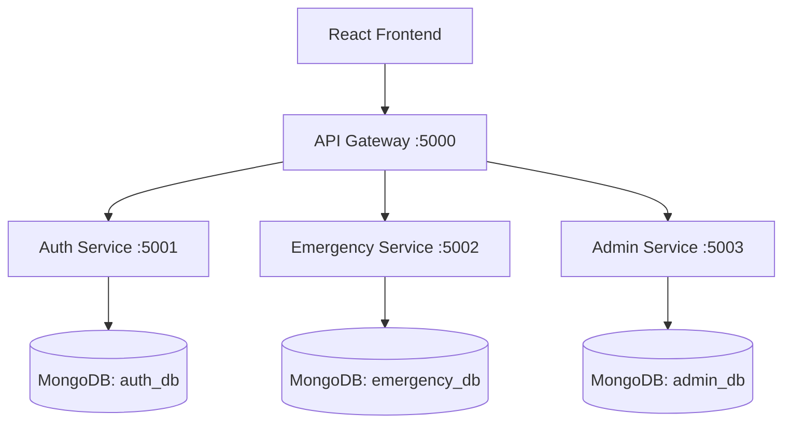

# Emergency Response & Smart Campus Management System

A comprehensive, microservices-based web application built on the MERN stack (MongoDB, Express, React, Node.js) designed to handle emergency response, complaints, and campus maintenance requests.

## Architecture

The system follows a modern microservices architecture, composed of a centralized API Gateway that routes traffic to specialized backend services, facilitating decoupled development and scalability.



## Services Overview

### 1. API Gateway (`backend/api-gateway/`)
- Acts as the single entry point for all frontend requests.
- Proxies requests to internal microservices securely.

### 2. Auth Service (`backend/auth-service/`)
- Manages secure user registration and authentication.
- Implements JWT (JSON Web Tokens) for stateless session management.
- Uses `bcryptjs` for strong password hashing.

### 3. Emergency Service (`backend/emergency-service/`)
- Handles the core lifecycle of emergency and maintenance requests.
- Users can raise emergencies, view their status, and track updates.

### 4. Admin Service (`backend/admin-service/`)
- Dedicated service for administrators to manage and oversee the platform.
- Allows admins to review incoming requests, change statuses to "Take Action" or "Resolve", and manage platform operations.

## Technology Stack

### Frontend
- **React.js**: For building robust user interfaces.
- **Vite/Create React App**: Tooling for the frontend ecosystem.
- **Axios**: For making API calls to the Gateway.

### Backend
- **Node.js & Express.js**: For building backend RESTful APIs.
- **MongoDB**: NoSQL database for flexible schema management.
- **Mongoose**: Object Data Modeling (ODM) library for MongoDB.
- **JWT**: For secure authorization between microservices.
- **Cors**: For handling Cross-Origin Resource Sharing.

## Running the Application Locally

> **Prerequisites**: Ensure you have Node.js and MongoDB installed on your system. MongoDB should be running locally on the default port `27017`.

### 1. Start the Microservices
You'll need separate terminals for each service.

**Terminal 1 (Auth Service)**
```bash
cd backend/auth-service
npm run dev
```

**Terminal 2 (Emergency Service)**
```bash
cd backend/emergency-service
npm run dev
```

**Terminal 3 (Admin Service)**
```bash
cd backend/admin-service
npm run dev
```

**Terminal 4 (API Gateway)**
```bash
cd backend/api-gateway
npm run dev
```

### 2. Start the Frontend Application
**Terminal 5 (Frontend)**
```bash
cd frontend
npm run dev
```

The frontend should now be running, typically accessible at `http://localhost:3000` or `http://localhost:5173` depending on the build tool used. The API Gateway listens on port `5000`.

## Features and Usage
1. **User Authentication**: Sign up for an account and log in. Secure tokens handle prolonged sessions.
2. **Raise an Emergency**: Submit detailed reports on incidents or maintenance requirements around the campus.
3. **Admin Actions**: Administrators can fetch all ongoing requests and update statuses, providing real-time feedback to users.
4. **Resilient Microservices**: Features distributed system durability, meaning each module runs its separate database collections and handles failures gracefully.

---
**Maintained by**: [ChaithaliShettigar](https://github.com/ChaithaliShettigar)

